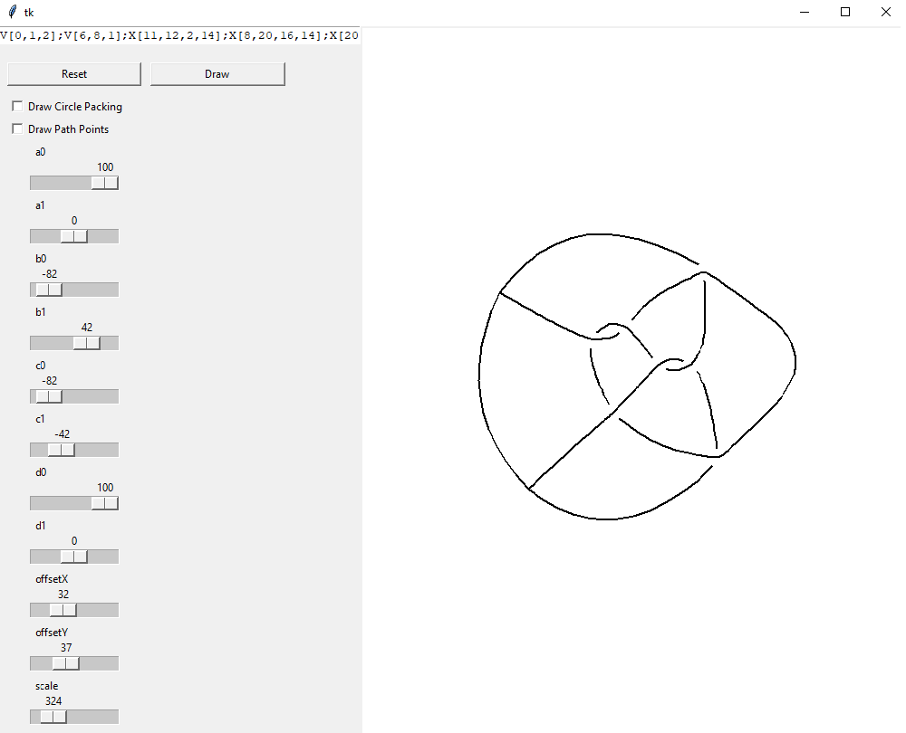

# PlanarDiagrams
Python implementation of converting planar diagram codes of knots, links and theta curves in to planar diagrams.

* interactive GUI mode
* png
* svg

## Interactive mode

Circle Packing             |  Result
:-------------------------:|:-------------------------:
  |  


``` 
PD-code:
V[0,1,2];V[6,8,1];X[11,12,2,14];X[8,20,16,14];X[20,18,22,16];X[10,9,11,22];X[13,0,12,7];X[18,6,13,3];X[9,10,3,7]
```

## Installation

Use the package manager [pip](https://pip.pypa.io/en/stable/) to install dependencies.

```bash
pip install -r requirements.txt
```

## Planar diagram codes

A dictionary of planar diagram codes: **codes.py**

## Usage

example.py

```python
import planar_diagram
import codes
import app

if __name__ == "__main__":

    # Render using matplotlib
    planar_diagram.get_planar_diagram(codes.PD["6^2_1++*"], "matplotlib")

    # Render png output/t57.png
    planar_diagram.get_planar_diagram(codes.PD["+t5_7"], "png", "t57")

    # Render svg output/t613.svg
    planar_diagram.get_planar_diagram(codes.PD["+t6_13"], "svg", "t613")

    # Run GUI
    app.App()
```

## License

[MIT](https://choosealicense.com/licenses/mit/)
